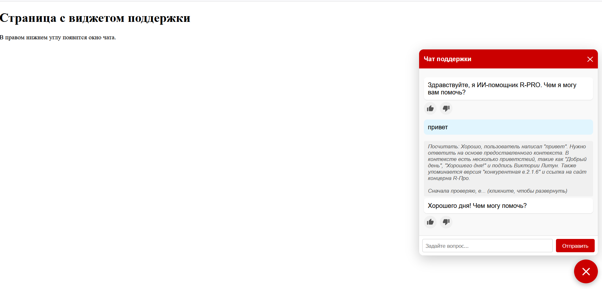
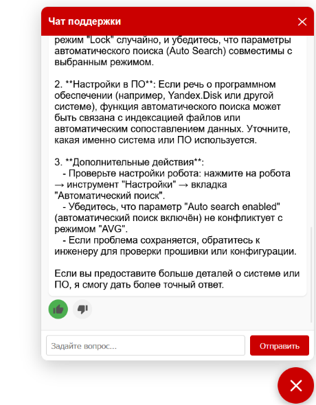
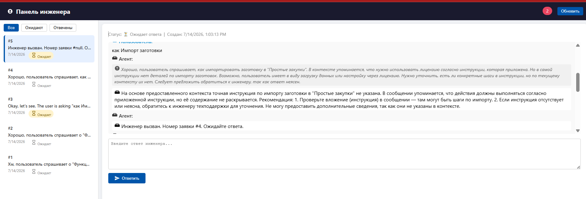
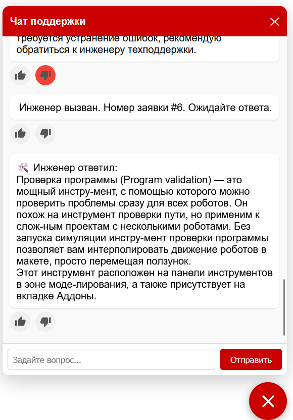

## AI agent R-PRO
Это задание предусматривает создание ИИ-агента, который будет автоматически отвечать на популярные вопросы на основе нашей документации и базы знаний. Цель — решить проблему на портале технической поддержки R-Pro, где пользователи задают множество повторяющихся вопросов о работе программного обеспечения, а инженеры отвечают на них вручную. Задача состоит в том, чтобы снизить нагрузку на первую линию поддержки и ускорить время ответа. Полный цикл: сбор данных → конвейер RAG → API → виджет → метрики.

### 1.  Пайплайн индексации (ingestion)
скрипт работает с моделью d0rj/e5-small-en-ru в автономном режиме. Он считывает документы, разбивает их на фрагменты, вычисляет эмбеддинги и записывает данные в векторную базу данных.
### 2.  Retriever 
извлекает top-k релевантных фрагментов для заданного вопроса 
### 3.  LLM-обёртка  
собирает подсказки (системные + контекстные + история + вопрос), вызывает LLM через абстракцию поставщика и возвращает ответ.
### 4.  Backend API
REST-эндпоинты чата, обратной связи, health. 
### 5. Frontend-виджет
встраиваемый чат:
-	POST /api/chat` — `{message, session_id, history}` → `{answer, sources[], no_answer}`.
-	POST /api/feedback` — `{message_id, rating, comment}`. обратной связи
-	GET /api/health`.
 -	GET: /engineer/ notifications — отправка уведомления инженеру о появлении нового тикета;
-	GET : /engineer/tickets: получение списка всех открытых тикетов
-	POST : /engineer/respond: ответ инженера будет отправлен в чат пользователя и использован для обучения модели, чтобы в следующий раз, когда такой же вопрос поступит от других пользователей, модель могла дать более точный ответ.
-	POST : /engineer/close-ticket: закрытие тикетов
-	GET:  /engineer/all-tickets: получение списка всех тикетов. 
### 6. Метрики, оценка качества
•	ROUGE-L: Оценивает лексическое сходство между сгенерированным ответом и эталонным ответом. Полезен для задач, где известен ожидаемый ответ. Эта метрика фокусируется на использовании одинаковых слов, поэтому она не всегда полезна. 
•	Hit Rate (Коэффициент попадания): Оценивает эффективность компонента поиска в нахождении релевантных документов. 
•	Semantic Similarity(Семантическое сходство): Оценивает, передает ли сгенерированный ответ тот же смысл, что и эталонный, даже если используются разные слова. 
•	Faithfulness(Точность): Оценивает, основан ли ответ на полученном контексте и не содержит ли он ложной информации. 
•	Latency(Задержка): Оценивает скорость работы системы от начала до конца.
•	Success Rate (Коэффициент успешности): Оценивает надежность и устойчивость системы, отслеживая, как часто запросы обрабатываются успешно..

 ИИ-агент запускается в виджете чата. Он будет отвечать на приветствия и вопросы о том, чем он может помочь. 


При решении задач из материалов R-PRO ответы брались из этих материалов. У каждого ответа есть две кнопки: лайк/дизлайк . При нажатии на кнопку « лайк » в отзыве фиксируется, что ответ соответствует ожиданиям пользователя, а при нажатии на кнопку « дизлайк » — что ответ не соответствует ожиданиям пользователя. После получения трех отметки « дизлайк » ИИ-агент создаст заявку и свяжется с инженером.

  
ИИ-агент создаст заявку (билет ) и отправит уведомление через API (весь API работает с JSON), после чего новая заявка отобразится на странице инженера http://localhost:8000/static/engineer.html . (воспользовались этой страницей в качестве примера, но она может быть подключена к любой другой платформе.) Инженер сможет просмотреть предыдущие сообщения и увидеть, как ответил ИИ.

в конце ответ появится в чате у пользователя 


# Предварительные требования
- Python 3.11 или новее (рекомендуется 3.11–3.13)
- Git (для клонирования)
- 7‑Zip (Windows) или p7zip (Linux/macOS) – для распаковки CHM-файлов


# instructions

## для обучения модели
### 1.  если обучение с использованием изображений
```
bash
docker-compose build --no-cache ollama
docker-compose up ollama
docker-compose exec ollama ollama pull llava
```
В файле .env параметр PROCESS_IMAGES должен быть установлен в значение true.
```
bash
python -m venv venv
.\venv\Scripts\Activate.ps1 // source venv/bin/activate (ubuntu)
pip install --upgrade pip
pip install -r requirements.txt

python -m scripts.run_ingestion

uvicorn backend.main:app  --host 0.0.0.0 --port 8000
python -m http.server 3000            

```

### 2. Если обучение проходит без изображений
В файле .env параметр PROCESS_IMAGES должен быть установлен в значение false.

```
bash
python -m venv venv
.\venv\Scripts\Activate.ps1 // source venv/bin/activate (ubuntu)
pip install --upgrade pip
pip install -r requirements.txt


python -m scripts.run_ingestion

uvicorn backend.main:app  --host 0.0.0.0 --port 8000
python -m http.server 3000            

```

## для открытия страницы тестирования ИИ-агента

```
bash

.\venv\Scripts\Activate.ps1 // source venv/bin/activate (ubuntu)
uvicorn backend.main:app --reload --host 0.0.0.0 --port 8000
python -m http.server 3000            


```
страница для чата с ИИ:
http://localhost:3000/test_widget.html

страница для инженерной поддержки:
http://localhost:8000/static/engineer.html

# работа с Docker
Существует возможность запустить весь проект в Docker, используя два контейнера: бэкенд и Ollama. Однако этот вариант требует значительных ресурсов для работы.
## запустить все контейнеры
```
bash
docker-compose up -d
```
## посмотреть, что оба контейнера работают:
```
bash
docker-compose ps
```
## скачать модель  в контейнер Ollama
```
bash
docker-compose exec ollama ollama pull llava
```
## посмотреть, что модель появилась
```
bash
docker-compose exec ollama ollama list
```

## Проверить доступность Ollama изнутри контейнера backend
```
bash
docker-compose exec backend curl http://ollama:11434/api/tags
```
## запустить индексацию внутри контейнера backend

```
bash
docker-compose exec backend python -m scripts.run_ingestion

```


# Установка chmlib или p7zip
Для работы pychm в некоторых системах требуется библиотека chmlib.
Или используйте p7zip вместо pychm.
Код проверит наличие библиотеки и воспользуется доступной автоматической библиотекой.
Для работы pychm в некоторых системах требуется библиотека chmlib.
Или используйте p7zip вместо pychm.
Код проверит наличие библиотеки и воспользуется доступной автоматической библиотекой.
Linux (Debian/Ubuntu):
```
bash
sudo apt-get install libchm-dev
```
Linux (RHEL/CentOS/Fedora):
```
bash
sudo yum install chmlib-devel // или
sudo apt-get install p7zip-full

```
macOS:
```
bash	
brew install chmlib // или
brew install p7zip

```
Windows	Через MSYS2: 
```
bash
pacman -S mingw-w64-ucrt-x86_64-chmlib 
```
 или через Cygwin
 или 7-Zip installer for Windows

# .env
```
bash
GROQ_API_KEY= "YOUR-GROQ_API_KEY"
# GROQ_MODEL= "openai/gpt-oss-120b"  "qwen/qwen3-32b" "mixtral-8x7b-32768"
GROQ_MODEL= "qwen/qwen3.6-27b"
LLM_PROVIDER=groq            # groq or ollama
OLLAMA_BASE_URL= http://ollama:11434  #http://localhost:11434  # docker: http://ollama:11434
OLLAMA_MODEL=qwen3.6  # llava:13b

TOP_K=4                   # количество чанков, возвращаемых поиском
VECTOR_TOP_K=30
BM25_TOP_K=30
LLM_TEMPERATURE=0.1
EMBEDDING_MODEL=intfloat/multilingual-e5-small  # модель эмбеддингов d0rj/e5-small-en-ru 
IMAGES_OLLAMA_BASE_URL= http://localhost:11434  #http://localhost:11434  # docker: http://ollama:11434
IMAGES_OLLAMA_MODEL=llava  # llava:13b
PROCESS_IMAGES=false
LOCAL_MODEL_PATH=F:\rag-support-agent\models\Qwen3-8B
USE_API=true       # Если значение равно true, используется API; если false — локальная модель.

# Настройки безопасности
RATE_LIMIT_PER_MINUTE=30
MAX_INPUT_LENGTH=500

#папки данных
DATA_DOCS="data/docs"
DATA_CHM="data/chm"
DATA_JSONL="data/jsonl"
DATA_FAQ='data/faq'
DATA_IMAGE="data/images" 
DATA_HTML="data/chm_html"

# Настройки повторных попыток для Groq
GROQ_MAX_RETRIES=3
GROQ_RETRY_DELAY=1

ANONYMIZED_TELEMETRY=false
FORBIDDEN_TERMS=ISimPlugin, AddComponent, RemoveComponent, XAML, SimLab.Application, ISimComponent, CreateComponent


```
# тестирования
```
bash
# 1. Провести полную оценку
python tests/evaluate_full.py

# 2. запустить диагностику
python tests/diagnose.py

# 3. Проведение исследования абляции (трудоемкий процесс)
python tests/ablation.py

# 4.Просмотреть результаты
cat tests/detailed_results.json

```
## Интерпретация метрик

| Metric | Good Score | Okay Score | Poor Score |
|--------|------------|------------|------------|
| ROUGE-L | > 0.6 | 0.4 - 0.6 | < 0.4 |
| Hit Rate | > 80% | 50% - 80% | < 50% |
| Semantic Similarity | > 0.8 | 0.6 - 0.8 | < 0.6 |
| Faithfulness | > 0.8 | 0.6 - 0.8 | < 0.6 |
| Latency | < 2000 ms | 2000 - 5000 ms | > 5000 ms |
| Success Rate | > 95% | 90% - 95% | < 90% |

# Подготовка данных
Поместите файлы знаний (PDF, TXT, CHM, JSONL) в папки:

- data/docs/ – для основных документов
- data/chm/ – для файлов справки CHM 
- data/jsonl/ – для файлов справки JSONL 
- data/faq/ - JSON-файл с вопросами и ответами,  Ожидает структуру: { "faq": [ { "category": "...", "question": "...", "answer": "..." } ] }

